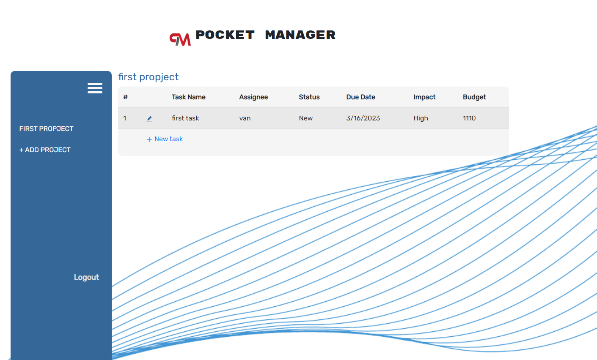

# Project_tracker

## Description
This project is to build a user-focused MERN app. The web page will let user to effectively manage project. User will be asked to login or sign up to the web page to use the app. Once user is logged in, user can create new project, add new tasks, and edit task details. 

## How to use
1. clone the repo
2. npm install
3. npm run develop

## Technologies used
* Front-end: HTML, CSS, JavaScript, Bootstrap, REACT
* Back-end: Node.js, Express.js, MongoDB, GraphQL
## Screenshot

## Deployment
https://project--tracker.herokuapp.com/

